# DOCUMENTATION

## Devlog #1 ->
I have finished the foundation of my project! The app currently has a simple UI and one AI tool that takes in a photo and tells you problems found in the photo whether it's with frayed wiring, loose screws, cracked/bent frames, or corrosion. 
Goal of my project: cut down the time it takes to find an issue so that a FRC team has more time to actually fix the problem and flag problems a human might miss during a rushed pit-stop check.
Overall, working with flutter to program a UI wasn't too bad. I have always been used to Java and JavaScript so although it isn't exactly the same, I soon learned how to write in Dart.
I've had the most difficulties with the implementation of the AI. At first, I started with an Ollama model. However, it was very slow so it would timeout before sending in anything that it had noticed in the photo. I then found that Google lets you use a free Gemini model so I got an API for that and finally added that. The new problem I faced was that everytime I tried to publish my app as a github page, the API key would turn off because the key wasn't safe. I finally learned that the key needs to be stored in a backend in order to function so I utilized Render.
I am so proud of how my project is looking so far! I plan to add more tools like a rules scanner. 

 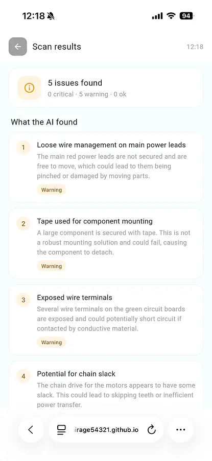

## Ship #1 - > 
### Anonymous feedback from other users at this point:
- When I tried uploading a photo of my team's bot, I got an error saying that the scan failed due to an exceeding of the quota from Google API's. It seems that the Gemini implementation isn't working properly due to an influx of people testing. Perhaps you could try to host some AI locally on the website itself? Not sure how that'd work out, though.
- Your project is really nice! Great job! Your project is very unique and something I haven't seen before. I also think that you did a great job in putting a lot of effort in developing the features. The usability was great and this type of project is very useful for robotics teams. Storytelling, however, could be improved. You could talk about challenges you faced and what features you are curious about for the future.
- first of all FRC MENTIONNED AYYY so so so cool and i understand how useful this could be so im super impressed the rule checking feature is so sick honestly would love to try it out but our robot is not present so i cant :( nice look to the app it looks clean and seems to run smoothly so keep up this amazing work :3 !!
- Nice project but since i dont have any robot to check i count try it so well but im pretty sure it works well. Keep up the nice work!
- Nice project but since i dont have any robot to check i count try it so well but im pretty sure it works well. Keep up the nice work!
- this looks good but it looks expencve in api credits and if you want better responces you need more MP and price is high and also with a team you can do this well
- This sounds like a good idea! I have some friends in FRC so I'll let them try it. One thing I would add is allowing people to upload multiple photos, as maybe just one photo isn't enough and it would be easier to show the whole robot. 
- Good idea, although I think it would have been better not to use an AI based system due to the negative connotations there in the nerd community.
- Hey great project! Let's start off with critiques. I think some more detailed devlogs/documentation would totally spice up your project. And a video demonstrating it might be worth it as not everyone has pictures of a FRC robot. I like how this project could have real world impact. I myself am on a FRC team and it's a pain when something you expect to happen the whole season fails to work because of a small thing you failed to catch with your eyes. The UI is nice and modern. I like it! Good work!
- Strong niche idea; demo is clear, and more examples/sample photos would help testing.
- Really good idea, however the dev logs could use alot of work, as there is only 1. However the finished product is quite usable and looks complete.
- I really like this project. I mean it is very needed, and I like how it is made. The main thing I would say it make the gui a bit more friendly, rather than having it so harsh, however besides that I really like the idea.

## Devlog #2 ->
Now that I've finished the foundation of my project, I can keep adding tools! On my last ship, I realized I should keep more documentation. So be ready for more devlogs going forward!
To get a little more comfortable with what I'm doing, I decided to add another AI scanning tool that I have been thinking about: a rules checker. The general scanner already looked for physical problems like wiring and cracks, but I wanted something that could actually check a robot against the official FRC rulebook. So I added the actual PDFs of past FRC game manuals (2024, 2025, and 2026) and let the user pick which season's rules to check against. That PDF gets fed into the AI alongside the photo, so instead of relying on whatever general FRC knowledge the model already has (which could be outdated or made up), it's reading the exact rulebook for that year while it looks at the photos/image.
Getting the PDF into the AI request in the first place took some figuring out. I had to load it from the app's assets, converting it into a format the API would actually accept, and making sure it got sent alongside the photos/image without breaking anything. Once it worked though, the difference was noticeable (the AI's answers started actually referencing real rules instead of guesses).
The bigger challenge was AI usage limits. Not "too many messages" though. Instead, it was more that other people using the same free model at the same time meant my requests were competing with everyone else's. Half the time a scan would go through fine, and the other half it just wouldn't, with no real pattern I could find.
To fix this I... haven't yet, honestly. Still an open problem :(. Hoping to hear from you guys for some ideas!
I'm a little nervous because AI kind of has a negative connotation in FRC. To address that issue, I'm planning to make the whole app not centered around AI so I'll be adding more tools.
Excited to keep going though, because I just started programming my new idea: adding a battery tracker!
View it here: https://mirage54321.github.io/RoboLens/

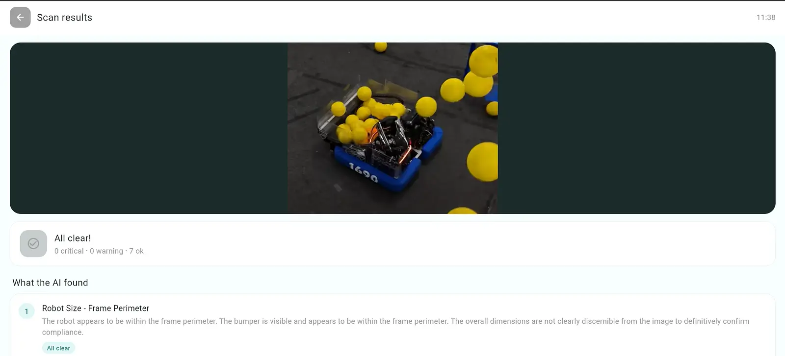
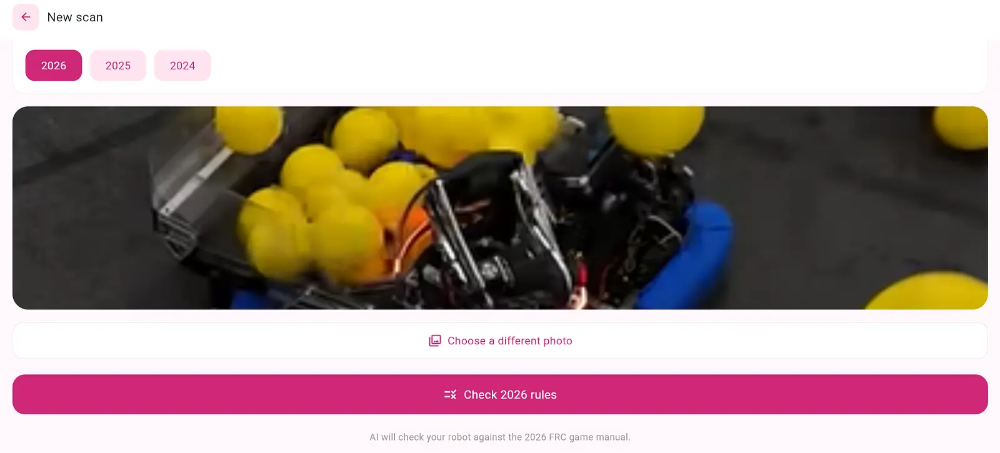

## Devlog #3 ->
In the past few days I have been working on adding a battery tracker because I believe that it has the potential to be very helpful to FRC teams. Tracking batteries is always a pain for my team, and other teams I've connected with can probably agree with that statement. Batteries can randomly fail by not charging or just full-on dying in two minutes. Although one might assume that keeping track of all this is easy, it truly is not. Having a system to hold records and data, I believe, can be very helpful to teams!
I've added the third tool to the app: a shared battery tracker where a team can log in with a team number and passcode, add batteries, and mark each one as charging, in use, or available. It also lets you flag a battery as weak or unreliable with a note, so if a battery dies mid-match, the whole team can see that history the next time they're deciding which one to grab. I even added an option for the AI to recommend which battery to use next based on how long it's been charged and whether it's been flagged before.
My new challenge for this tool has been working with MongoDB. It stores the data fine, but it wasn't letting me log in (it kept throwing an error). What confused me more is that when I ran it in Flutter web, it worked just fine. This is what I plan to work on for the next few days.
To fix my last problem, which was with the AI saying it had spikes in usage, I changed the message to ask the user to try again because it usually works on the try right after. Right now, this is just a temporary solution until I can find a new AI model.
List of things to work on:
- Low MongoDB storage for free account
- Report button on the UI needs to feed into the AI
- Find permanant solution for the AI usage
- Connenction to MongoDB working for flutter web but not github?
- Photo to video (that way it can help you find the right orientation for the AI to scan with the best feedback possible)
View it here: https://mirage54321.github.io/RoboLens/
  

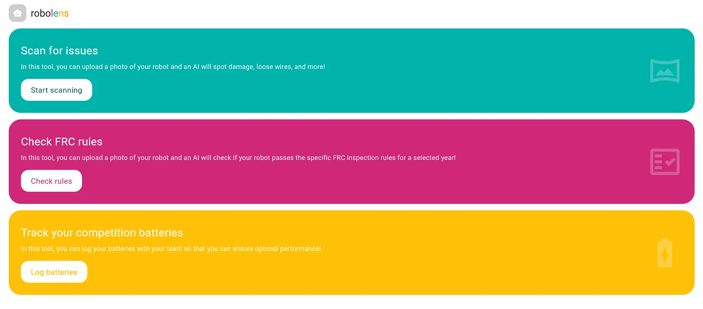

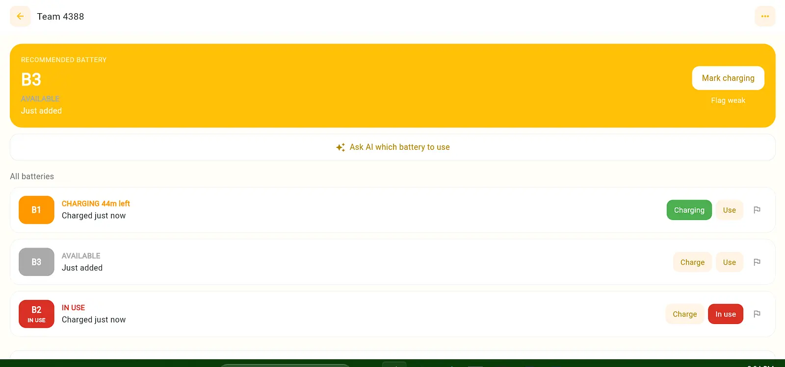

## Devlog #4 ->
Hey! I have been working on the issues I talked about in my last devlog. So far I have successfully solved one:
How I solved "Connenction to MongoDB working for flutter web but not github?" ->
The issue was that GitHub Pages is a static hosting service and couldn't connect directly to MongoDB. Therefore I had to update the application so the GitHub Pages frontend communicates with the Express backend on Render. Basically, I just modified some of the backend configuration like changing (in very very simple terms): fetch('/battery') to something like fetch('https://ridgeboticsapp.onrender.com/battery').
I also added a ? mark button so that if clicked on it can tell you a little more about the app. Right now, it is just saying some basic things but I plan to show this app to my friends and see what they think I should add to that text in order to help people figure out what is going on if they just found my app.
Finally, I fixed an error I wasn't even aware of: the name finder for each teams batteries. I made it so when you sign up your team, it will try to search up the team name with that FRC number. However, there would be times where I would sign in as my team and it would show up with some random name like "Robo-Knights" or something weird. I think this was related to the Gemini model because I had used it while testing, soincorrect team names could have been stored and reused instead of being verified.
To fix this, I connected my backend to the official FRC Events API. Now, the app sends the team's FRC number to FIRST to retrieve the official team information to then save the verified team name. This prevents teams from accidentally being assigned another team's name and makes sure the battery data is connected to the correct FRC team.
It was never too big of an issue because I could always just edit the names in MongoDB but having it so it says the name right 100% of the time is just much easier for me.
Now my new top things to work on are: 
- If team is signed up but you don't have access to your team
- Photo to video (that way it can help you find the right orientation for the AI to scan with the best feedback possible)
- Report button working better to fix the AI's findings
View it here: https://mirage54321.github.io/RoboLens/
P.S. If you are trying things out you can sign in as a guest for 4388 and see my teams batteries

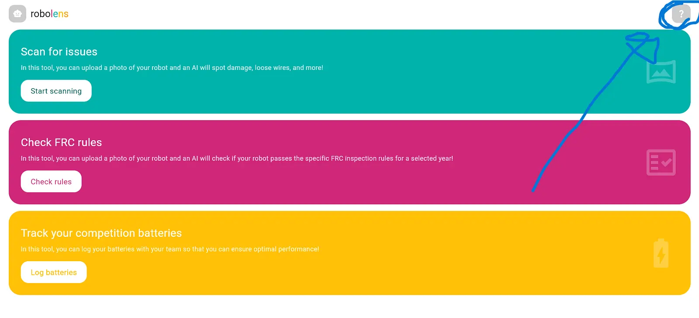
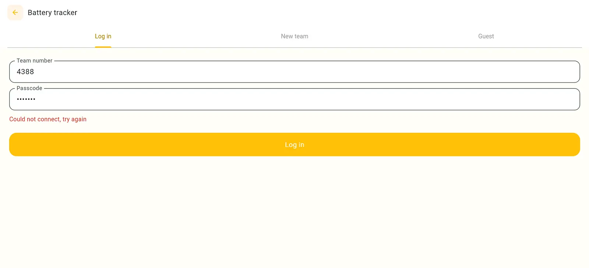
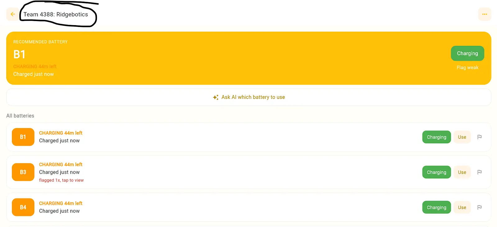

## Devlog #5 ->
My app now has a load in screen! Yay! I figured it was necessary just to make my whole app look more professional. It was pretty easy (took lots of time though) to add and I didn't fall into any huge difficulties. Only a mini one because I tried to make the animation in the home screen class and it got chaotic. Once it was its own file it was quite easy because then I just needed to fix up the UI.
Look here if you want to learn more about how to do animations in your own project (if using Flutter): https://docs.flutter.dev/ui/animations
I also added a very tiny change to the error message for logging in. Instead of saying "Team already registered", it tells you to contact my email if you cannot access your team. I guess I got really nervous that someone would try to access their team, and if they couldn't, they would go and put another team's number and so on indefinitely. Right now, I think this is a good way to fix the issue, but I'll add a way to report it in the app; that way, the issue can be solved quicker, and you won't have to send an email to someone. I did have the idea to make it so there is identification of some sort for each team; however, that would just make the app complex, and my whole goal was to have a simple solution to problems. So, if this app actually does really well in the FRC world, I will add some sort of verification; that way lost accounts can be found, and it would just give all-around easier access.
Next, I am going to focus on my long put off task: photo to video. I am not sure how I am going to do this, if I am going to be so honest. My idea for it came fom the Smile Doctors invisalign app where it opens up your camera and tells you things like "go to better lighting" or "move to the left". However, I think that will be super complex and difficult to implement so I might have to start a lot smaller. Best of luck to myself, I guess!
List of current tasks:
- Low MongoDB storage for free account 
- Report button on the UI needs to feed into the AI ⭐
- Find solution for Render (takes a long time to power on and first time you try to do anything it always fails)
- Photo to video (that way it can help you find the right orientation for the AI to scan with the best feedback possible) ⭐⭐
View it here: https://mirage54321.github.io/RoboLens/

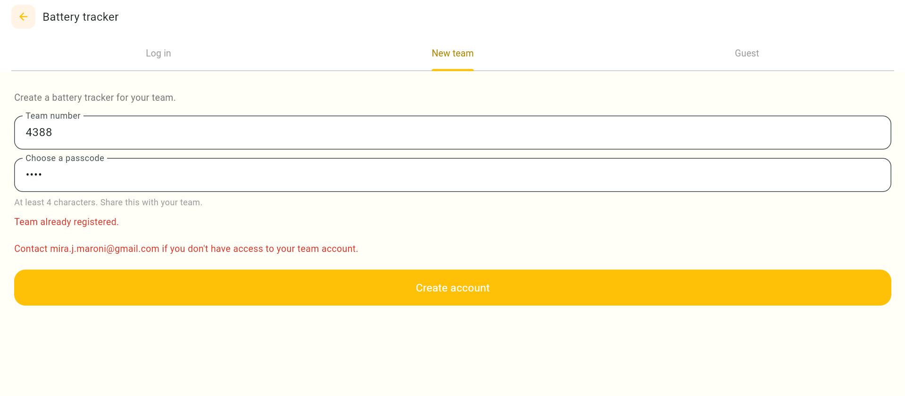

## Devlog #6 ->
Part 1/2
Hey! I know it has been awhile since I worked on my project (adding the guided camera has been taking a lot of will power), but I have a new update.
I have added the guided camera to the scan screen (which I will add to the rules screen too after it is finished). The process that the guided camera uses is:

Startup -> requests camera permission immediately for phone usage (permission_handler) or waits for a tap on "Enable Camera" first for browser usage.
Camera setup -> fetches available cameras (from Flutter's camera plugin), picks the back-facing one (falls back to the first available camera on the device if no back camera is found), sets resolution to high on phone or medium on browser (since browsers often reject high-res requests), then calls initialize() to start the live preview.
Manual fallback for taking photos -> the shutter button is always available to captures the photo; this is the primary method right now.
Capture -> stops the frame stream (phone only), takes the picture, reads the bytes, then returns them to the previous screen via Navigator.pop(context, bytes).

An issue I ran into was camera permissions on iPhone Safari. It worked fine on my laptop but wouldn't work on my phone. I eventually figured out that iPhones are notorious for always requiring explicit permission prompts, so I solved it by requiring the camera request to be triggered by a direct user tap. Basically, I added an "Enable Camera" button on web that only calls the camera setup when tapped, since iOS Safari silently blocks getUserMedia (instead of showing an error) if there's any delay between the tap and the request.
Now I am working on the flutter comments ("too dark", "focus", etc.) because right now those aren't working. Once I get the live guidance to work, then I will be able to implement an auto-capture (that way the photo is taken when at a good angle).

View it here: https://mirage54321.github.io/RoboLens/

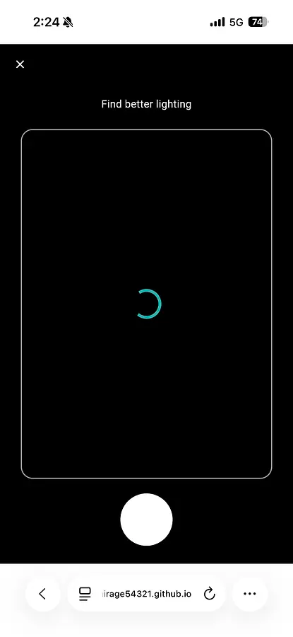
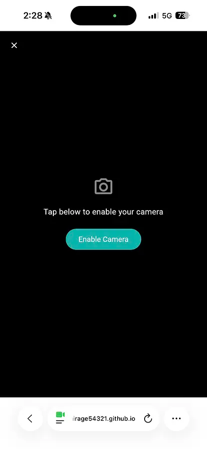
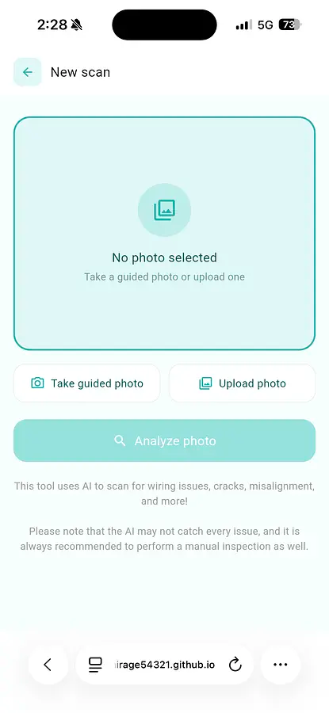
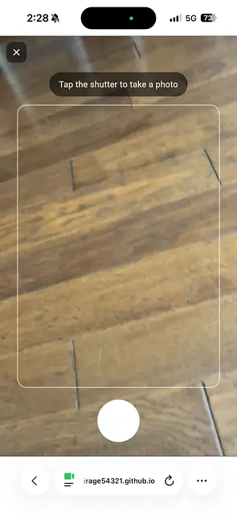

## Devlog #7 ->
Part 2/2 (but part 1 of this devlog)
Okay. This was very annoying to work on because every single time I would edit the code, I would have to recommit in order to see it on the github pages (because the permissions wouldn't work on the flutter web-server).
So, getting the guided camera working on web brought a whole lot of browser-specific issues that don't show up on native mobile. First, the app would hang on a black loading screen because permission_handler and frame streaming aren't supported in browsers. I then fixed that by branching on kIsWeb to skip those native-only calls and let the browser's own getUserMedia prompt handle camera access instead.
Next, iOS Safari blocked the camera request outright because it requires permission calls to fire directly from a user tap with no delay -> solved by gating the whole flow behind an explicit "Enable Camera" button instead of auto-starting on page load. Since camera_web doesn't support live frame streaming and sensors_plus doesn't handle iOS's motion permission prompt, live guidance (tilt, brightness, sharpness) had to be rebuilt from scratch for web: a custom JS-interop layer (WebProbe) draws each video frame onto a hidden canvas to sample brightness/sharpness, and separately requests iOS's DeviceMotionEvent permission to read tilt.
That introduced two more subtle bugs (a Dart generics issue causing a null-cast crash in the interop code, and a timing issue where the <video> element wasn't in the DOM yet when we went looking for it) both fixed with explicit type arguments and a retry loop.
With all of that sorted, the guided camera now works consistently across native and web, with live tilt/lighting/sharpness feedback and autocapture.

View it here: https://mirage54321.github.io/RoboLens/

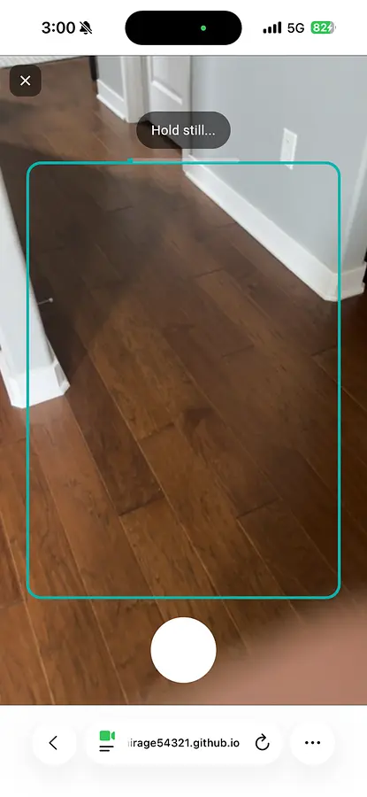
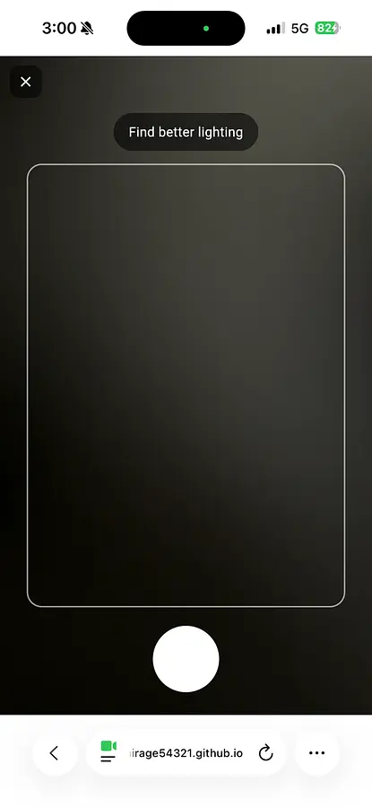

## Devlog #8 ->
Part 2/2 (part 2 of this devlog)
I also posted my app onto reddit (r/FRC) and got some feedback. From the feedback, I got the message that an AI scanner can't be all that reliable/useful without a user-end customization. I totally agree with this. The problem is that I'm not sure if it is worth it to spend time on adding in customization tools for the AI as there is not a lot of return from it. Therefore, I think that right now the AI's are at the best product they can be as of now (besides adding functionality to the report button). So, my time would be better spent adding in more apps into the app. On the bright side, there were lots of positive reviews about the battery section!

I am now going to work on the report button for the UI because I think it will take less time to add than adding a fourth app. In my next post, I will have a confirmed idea for the fourth app!

Things to work on:
- Low MongoDB storage for free account 
- Report button on the UI needs to feed into the AI ⭐ (Going to do this first because it is easier)
- Find solution for Render (takes a long time to power on and first time you try to do anything it always fails)
- Adding fourth 'app' ⭐⭐

View it here: https://mirage54321.github.io/RoboLens/

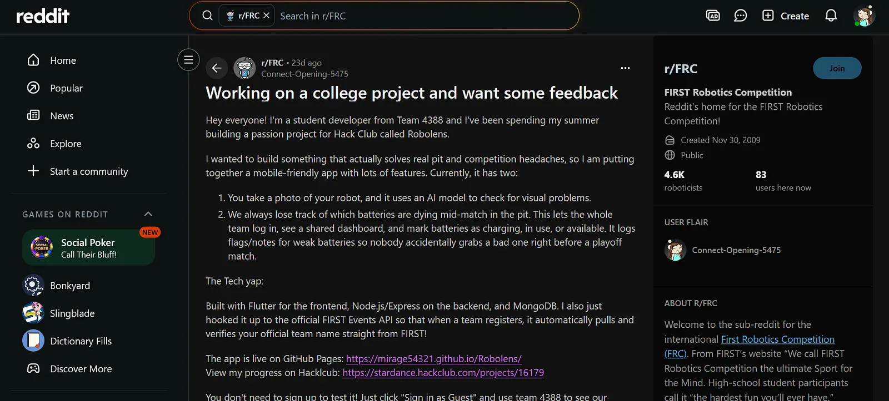

## Devlog #9 ->
Okay, so getting the report button to work was a little finicky. I wasn't sure what approach to take: I could make it easy by just sending me the reported things and I could look at them and just change the prompt, or I could make it difficult by just feeding every single reported issue back into the AI model so that the AI tries to not make the same mistake (which might be a problem becaue someone could report something that was actually right), or make it VERY difficult make it feed back into the AI if a similar issues were coming up again and again. Guess which one I chose?
Yup, the third. Basically, I decided to store the reports in MongoDB and look for recurring mistakes instead of letting a single report change the AI. That way, if one person reports something incorrectly, it doesn't immediately affect everyone else's scans. If the same type of mistake keeps getting reported, I can investigate it and use those reports to improve the AI.
This seems really complex, and it was. It took me 4 hours (it says 6 on the devlog but 2 of them was working on the 4th app).
Alright, ready for my fourth widget idea.......... a match notifier!! Now don't get too excited. I have more to tell. So, every FRC kid knows that there's a website called Nexus that sends messages for when your game is going to start so you can get in queue, and it works really well. There's also this thing I came across called statbotics, and it calculates many things like EPA, and more (I didn't really stay on that website for too long). So, what I plan to do is combine them. Hopefully, I'm not getting myself into too much of a challenge. This will most definitely be the hardest thing I have ever done on this app. Wish me luck!
P.S. I started making the fourth widget before the report button then switched to finish the report button halfway so if you see my commits in a confusing order that's why.

View it here: https://mirage54321.github.io/RoboLens/

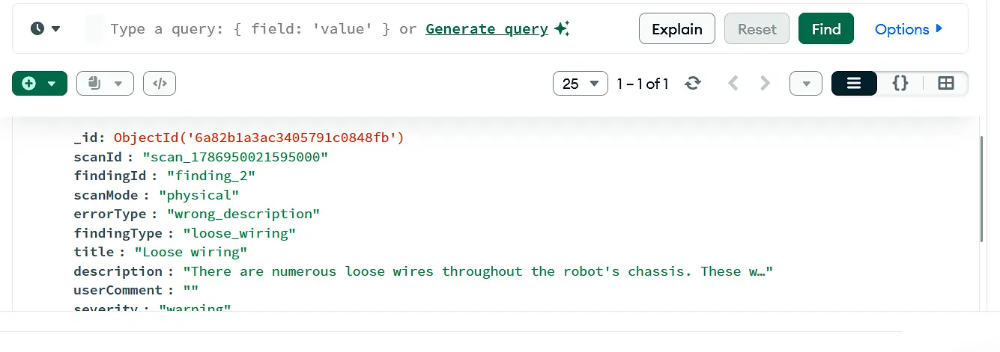
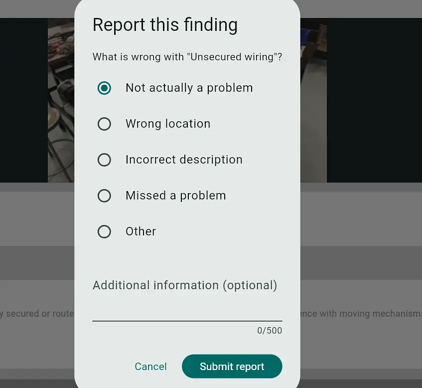

## Devlog #10 ->
Part 1 of 5
Please don't hurt me, but I have to post multiple devlogs because I worked on so many things in all this time. It's a lot of stuff to talk about and I don't want to write it all into one because it will be super unorganized and hard for me to find in the future.
In this first devlog, I am going to talk about how I got bookmarks to work.
The idea came from thinking ahead to the match notifier. If someone wants alerts for a match, they need a way to say "these are the teams I care about" without having to retype a team number every single time. So I added a bookmark system using shared_preferences (just storing a list of team numbers locally on the device/browser). You can now star a team from a few places in the app and it'll save to your bookmarks list, which I'm planning to hook the notifier into so it can just loop through your saved teams instead of asking you every time.
This one was honestly pretty painless compared to my usual chaos. The only annoying part was making sure the bookmarked list actually persisted correctly on web (learned my lesson from the MongoDB flutter-web thing, so I tested this one on both platforms before moving on lol). Turns out shared_preferences just works with localStorage under the hood on web, so no weird surprises this time.
Short devlog, I know, but wait till you see what devlog #11 turned into.

View it here: https://mirage54321.github.io/RoboLens/

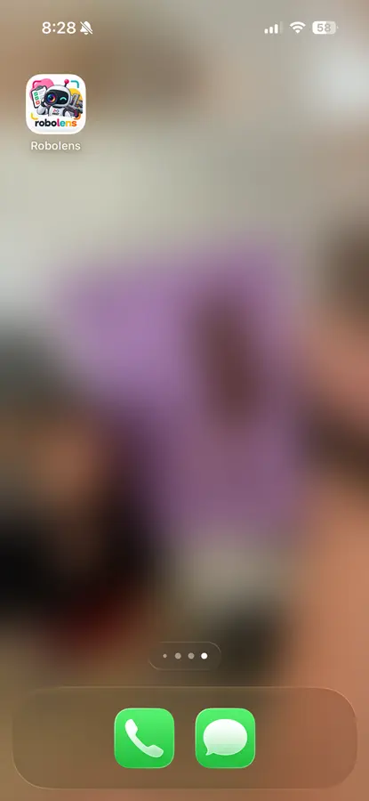
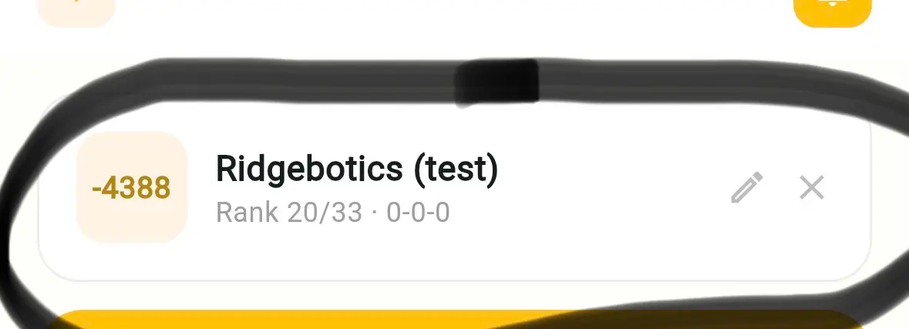
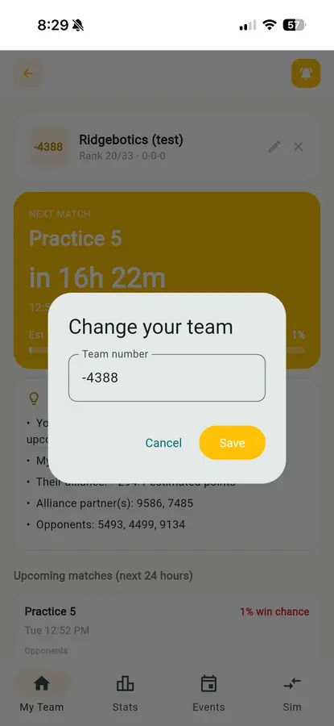

## Devlog #11 ->
Part 2 of 5
Now for the second devlog, I am going to talk about how I got notifications to work. This is the one that ate my week.
So the goal: when a match is coming up for a team you bookmarked, get a push notification even if the app/tab isn't open. That last part is the whole problem, because it means I can't just pop a normal in-app alert, I actually need real browser push notifications, which meant learning a whole new stack: service workers, VAPID keys, and the Push API.
Here's roughly how it works now ->
Subscribe -> user picks a team number + event key, the app asks the browser for notification permission, and if granted it registers a push subscription through the service worker using my VAPID public key.
Send to backend -> that subscription (plus team number/event key) gets sent to my Express backend and stored in MongoDB.
Actually sending them -> the backend uses the web-push npm package to send the push whenever it detects a match coming up for that team.
Getting the Flutter side to talk to any of this was its own adventure, since none of this exists as a nice Dart package, so I had to write a JS interop layer (basically a matchPush object in plain JS that Dart calls into) and wire it up through the same conditional-export trick I used for the guided camera: one file for web, one stub file that just says "unsupported" for native, so the app doesn't explode on phone builds while I haven't built native push yet.
Problems I ran into (there were many) ->
iOS Safari straight up does not support web push at all unless the site has been added to the home screen first. So right now notifications basically only work reliably on desktop browsers and Android, and I have to eventually explain that to iOS users somehow.
Permission requests have the same "must be triggered by a direct tap" rule I fought with on the guided camera, so subscribing has to happen from an actual button press, no auto-subscribing on load.
Debugging this was rough because half the errors happen silently in the service worker, not in the normal Flutter console, so I was stuck adding console.logs into push.js and checking devtools like a caveman for a while.
It works now though! Bookmark a team, subscribe, and you'll get pinged. Native (phone-installed) push notifications are still a "later" problem since that needs a totally different setup (probably Firebase Cloud Messaging), so for now the stub just returns unsupported on native and I'm keeping my scope to web.
Two devlogs about the 4th app itself coming up next, promise.

View it here: https://mirage54321.github.io/RoboLens/

P.S. For right now there are 3 notifications that send for iOS I plan to change that though!

## Devlog #12 ->
Part 3 of 5

Okay, actual 4th app time: Team Stats & Match Center (internally I've just been calling it "match" in the code, so if you dig around the file names that's why).

I started by mocking everything out before touching any real API, just so I could get the UI feeling right first. Made an intro screen (basically pitching the three features: match alerts, team stats, matchup simulator) and a fake mockTeams list with made-up EPA numbers just so I had something to look at while building. Once the layout felt right, I started swapping the fake data for real stuff from The Blue Alliance's API, proxied through my backend the same way I already had set up for the FRC Events API (so I'm not spamming TBA directly from a bunch of client apps and to keep my API key private).

Architecture-wise, I did something different from my other three apps: instead of passing state down through a million constructor params, I made a MatchDataController (basically one class holding all the team/event/match data + loading state) and wrapped the whole feature in a MatchScope, which is just an InheritedNotifier. So anywhere in the match center I can just call MatchScope.of(context) and get the controller without threading it through every single widget. Probably overkill for how big this feature ended up being, but once I had 4 tabs and a handful of sub-screens all needing the same data, I was really glad I did it this way instead of my usual pass-everything-into-the-constructor approach.

Speaking of tabs, I split it into 4:
- My Team -> your team's own info/next match
- Stats -> a season-wide "World Rating" I calculate from aggregating TBA's OPR data across events (this was its own whole thing, might do a separate devlog on it someday)
- Events -> browse every FRC event, filter by time or location, see who's live right now
- Sim -> the matchup simulator I keep promising

Getting match data to actually parse right from TBA's JSON took a minute (comp levels like qm/qf/sf/f needed their own label logic, predicted_time vs actual_time needed fallback logic since actual_time barely ever gets posted until after the match is already over, that kind of thing) but nothing too crazy, just tedious model-writing.

Devlog #13 is basically a straight continuation of this one, mostly bug stories and the simulator, so heads up on that.

View it here: https://mirage54321.github.io/RoboLens/

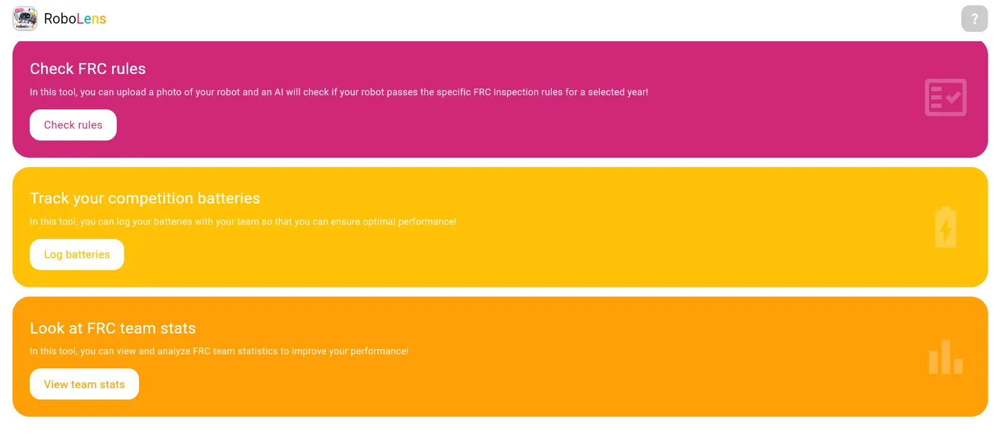
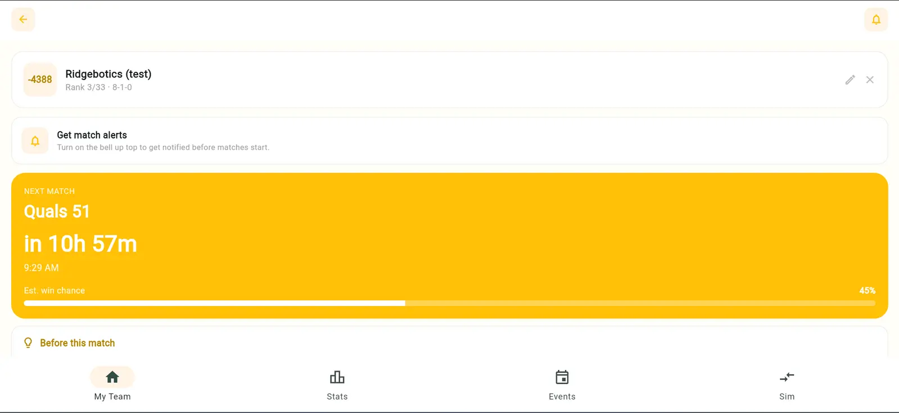
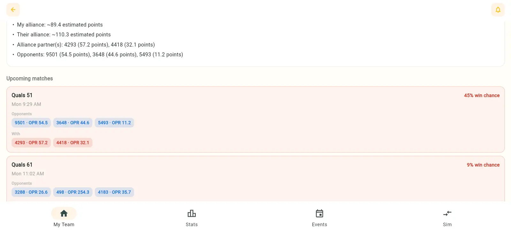
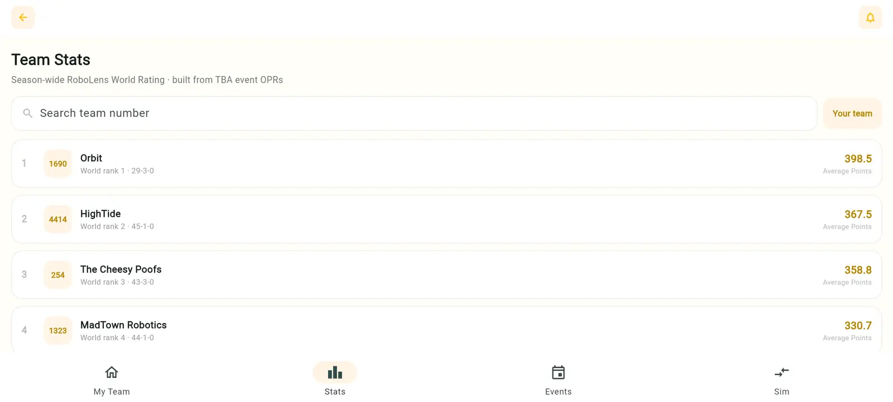

## Devlog #13 ->
Part 4 of 5

Continuing from #12: more on the match center, mostly the stuff that actually broke on me.

Biggest bug of the bunch: on the Events tab, tapping into an event was supposed to show "scheduled to attend" info and the competing teams list, but both of those sections would just spin forever, no error, nothing. I assumed it was a network timing issue at first and went down a whole rabbit hole adding timeouts and retry logic that did absolutely nothing. Turns out the actual problem was way dumber: when I pushed the EventDetailScreen with Navigator.push, that screen gets placed in the Overlay as a sibling of the tab tree, not a child of it, meaning it's NOT under my MatchScope anymore. So the second that screen tried to call MatchScope.of(context), it threw an assertion error immediately, before initState even got the chance to call setState and load anything. The spinner wasn't stuck because of a slow network, it was stuck because the load call never even ran. Fixed it by just re-wrapping the pushed route in its own MatchScope using the same controller instance. Felt very silly once I found it, but also weirdly satisfying to finally understand.

Next was the matchup simulator and win probabilities. On the schedule screen I show a rough "Red 45% / Blue 55%" prediction for each match. My first instinct was to use each event's own OPR for this, but that falls apart for upcoming events since OPR doesn't exist until a team has actually played a match there. So instead I based predictions on the season-wide World Rating from the Stats tab (average points across every event a team's played all season), which actually gives predictions even for a event that hasn't started yet.

Also went back and hooked the push notification bell (from devlog #11) directly into the match center's top bar now that there's finally a "your team" + "your event" to actually attach a subscription to. There's a little pulsing glow animation on the bell the first time you land on a screen where you could enable alerts, just so people notice it's there instead of it blending into the top bar. Took way too many attempts to get the glow animation timing feeling smooth and not epileptic-seizure-inducing, but I think I landed on something decent.

Genuinely didn't expect the 4th app to take this many devlogs but here we are. One more to wrap up some small stuff and then I think I'm caught up!

View it here: https://mirage54321.github.io/RoboLens/

r

## Devlog #14 ->
Part 5 of 5

Finally! This final devlog is about the small tweaks I made in the app.

1) I made it have a new photo
Small one, just swapped out one of the app's photos/images for something more current since the old one was from way back in devlog #1 and didn't really represent what the app looks like anymore. Nothing technical here, just housekeeping.

2) It kinda works offline
I say "kinda" because this isn't a real offline mode where you can browse cached data with no internet, it's more like the app now knows when it's offline and fails fast instead of just hanging. Basically, I added a ConnectivityCheck helper that on web reads navigator.onLine (a free, instant, synchronous browser check for whether the device has a network interface up) so if you're in airplane mode or your wifi is off, the AI scan screens can immediately say "can't use this when offline" instead of sitting there for a full request timeout before failing. On native platforms there's no real equivalent without pulling in a whole new plugin like connectivity_plus, so I just made the stub always report "online" there — an actually-offline phone still gets caught by the AI request's own timeout/retry handling, just without the instant fail I get on web.

One thing worth noting: this only checks if the device thinks it has a network connection, not whether that network actually has working internet behind it. So a wifi network that's connected but dead will still say "online" here. That case still gets caught eventually, just the slower way through the request timeout instead of instantly. Good enough for now though, this was mostly about killing the most common case of someone trying to scan with their phone in airplane mode and just watching the app hang.

3) I changed the load in screen
Went back and reworked the loading screen from devlog #5. It's now a plain CSS screen sitting directly in index.html instead of living inside the Flutter app itself, which means it can actually paint the instant the page loads, before Flutter has even finished downloading and booting up. That was the whole point: the old version technically only appeared once Flutter itself was far enough along to render it, so there was still a blank/white flash before it. Now there's a little animated wordmark and spinner (the spinner's colored arc cycles through the same colors as the logo letters) that fades out and removes itself once Flutter fires its first real frame.

While I was in there I also fixed something unrelated but annoying: Flutter's web service worker by default waits to activate a new version until every open instance of the app is fully closed, which for something people add to their home screen basically never happens naturally. So people could keep opening an old cached version of the app for a long time after I'd pushed updates. Added a bit of JS to force any newly installed service worker to skip that wait and take over immediately (reloading the page once it does), so the next time someone opens the app after I ship something, they actually get it.

And that's it, I'm all caught up! Five devlogs in one sitting was a lot, but future updates should go back to being posted as I actually build them instead of in one giant backlog dump.

Current problems / what's next:
- Low MongoDB storage for free account
- Releasing the app (onto chief delphi to get feedback)!!
- Making it ready to release (working on the ? and report button)

Future ideas: team tracker, public chat for teams, judging/interview prep tool, callout tool, round robin generator

View it here: https://mirage54321.github.io/RoboLens/

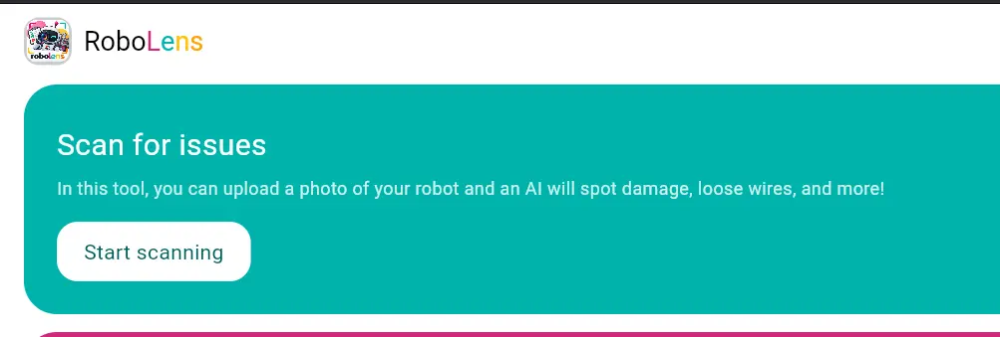
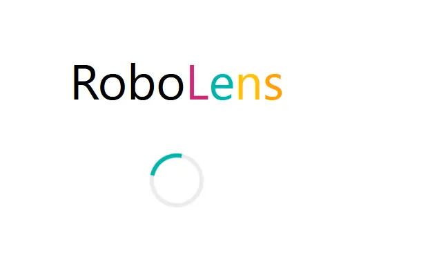
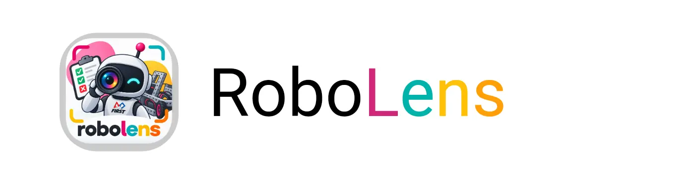

## Devlog #15 ->
Part 1 (still working on this one!)

Finally started actually tackling the AI usage limit problem from devlog #2. Since everyone using the app shares the same free-tier Gemini key, scans would just randomly fail with no real pattern whenever enough people were hitting it at once. Started on the backend side first: instead of letting every incoming scan hit Gemini immediately, I added a little queue that only lets 2 requests be in-flight to Gemini at a time, and everything else waits its turn. Next step is getting it to actually retry instead of just failing after the wait, but that's for the next devlog.

## Devlog #16 ->
Part 2, continuing from #15

Got retries working on top of the queue from last time. If Gemini comes back with a 429 (rate limited) or 503 (overloaded) instead of an actual answer, the backend now waits and tries again automatically, using exponential backoff (2s, then 4s, then 8s) instead of hammering it again right away, up to a few attempts before it actually gives up and reports failure. It also checks for a retry-after header first and uses that instead of the backoff timer if Gemini actually tells us how long to wait. Then I mirrored the same idea on the Flutter side, so if the backend's retries still aren't enough, the app itself will retry the whole request a couple more times before showing the user an error.

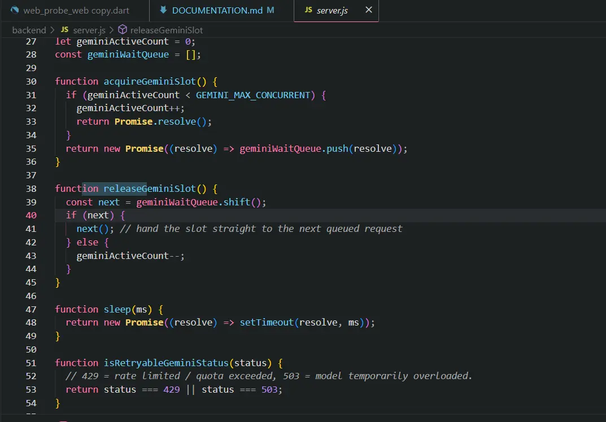
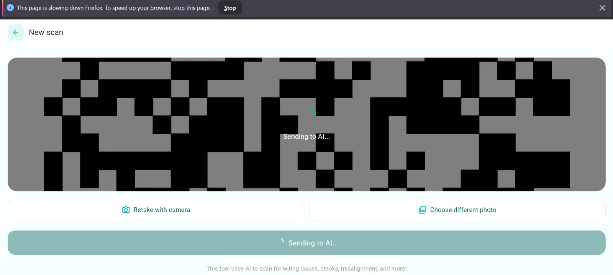

## Devlog #17 ->
Part 3, wrapping this one up

Last piece was making the retrying actually visible instead of just quietly happening in the background. Before, if a scan was retrying you'd just stare at a spinner with no idea what was going on. Now the loading screen updates to say something like "High demand. Retrying (2/3)..." so people know the app hasn't frozen, it's just waiting its turn. Between the queueing, the backoff retries on both ends, and this messaging, this should turn a lot of what used to be "scan failed, try again" moments into just a few extra seconds of waiting instead. Doesn't make the free tier limit go away entirely, but it's a big improvement over what I had.

Current problems / what's next:
- Low MongoDB storage for free account
- Professionalizing

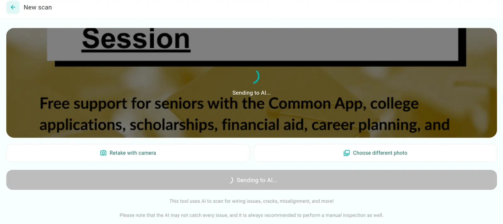

## Devlog #18 ->
Okay, super short devlog just to explain what I am doing. Basically all my hours are spent on fixing the notifications. It is super annoying right now because I am trying to finalize my project and the notifications randomly stop working. I tried clearing out mongoDB and checking on my cron-job and those seem to be working just fine. I'm not sure what to do. I pushed the hours up (for the practice day so I can check it earlier) and redeployed with Render. I shall see tomorrow if it works.

View it here: https://mirage54321.github.io/RoboLens/

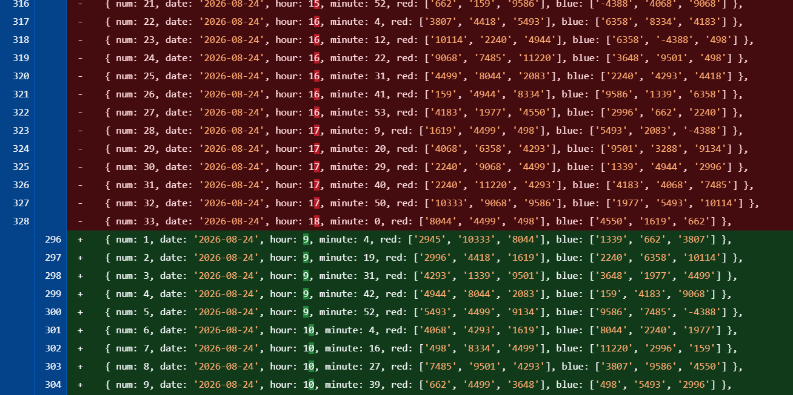

## Devlog #19 ->
I know I just committed a bunch the last few days. I guess I realized there is only a few days left and I found how to be way more efficent in getting hours. If I just keep this open and something else on another computer and work with them kinda being different windows then I get a lot more time because the switching of windows in the same computer made me keep forgetting to come back and work on the project (and I'm guessing was cutting the time too).
Anywho! The most recent changes I have made is removing the ? mark button. I think I was going for a like "about me" thing but I think it was a little redundant and kind of unneccessary to say the least. I added a report button instead (it's just in the home page). I got this idea from lovable which was something I worked with during my internship. I highkey have been working so much on this project (you can see by all my hours) that I didn't want to connect it to the backend. It is just a popout that takes you to an gmail link and you can click send. Maybe if I run out of ideas I can add it as a backend.
Now, if I am going to be so honest. I have worked a lot on this project and I want to ship but I also want to just crank out some more hours. I'm extremely proud of this project and I need to get it out to the world so that I can get some users!

My issues to work on are:
- Low MongoDB storage for free account
- Professionalizing (now just looking back over and seeing if there is anything I wanna fix before putting on chief delphi)

View it here: https://mirage54321.github.io/RoboLens/

## Devlog #20 ->
Notifications are working again! Basically, the rebuilding of Render helped fix the issue which is kind of ragebait. I'm getting a little nervous though because I wonder what happens if someone doesn't reopen the bookmark (because that is how it resets). Would they still get the messages? Will it update automatically?
Overall, it works great. I just worry there may be an error that arises (that is a risk with any project honestly). 

View it here: https://mirage54321.github.io/RoboLens/

## Devlog #21 ->
Updates!!! Basically, I've been checking to see how many users and views I have. I have google analytics on my project to keep an eye on it. Right now I have 52 users and 163 views. Which honestly, I am pretty dang happy about. 
(1) I haven't really been advertising
(2) I literally thought it was gonna be like 20 views
Woop woop! Okay, now on these past few days I have been working on getting as many hours as possible. I don't have a personal computer so I am really aiming for literally any of the laptops. 
Now, programatically I have been working on removing the 3 burst messages for iPhone (it wouldn't compact itself on the Apple homescreen).
FYI: 90% of the time for this was spent removing the 3 burst messages for iPhone and writing Ship #2... so you better be ready for Ship 2!

View it here: https://mirage54321.github.io/RoboLens/

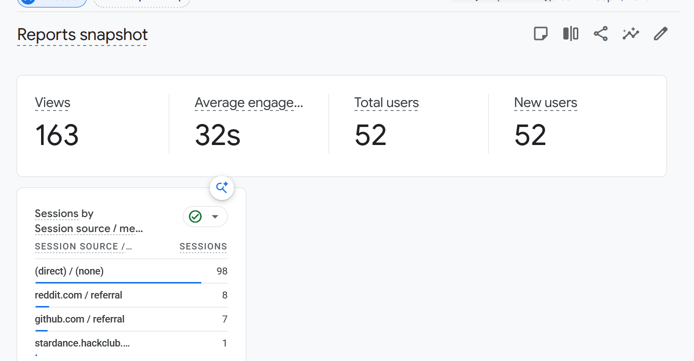

## Ship #2 - > 
What did I make?

Since Ship #1, RoboLens grew from one AI scanner into four connected tools. I added a rules checker that reads the actual FRC game manual (2024–2026) alongside your robot photo so it's grounded in real rules instead of guessing. I built out a full shared battery tracker. I added a guided camera that walks you through lighting/tilt/framing and auto-captures once the angle looks right. And the biggest addition: a Team Stats & Match Center with four tabs (My Team, Stats, Events, Sim) pulling live data from The Blue Alliance and the FRC Events API, including a season-wide "World Rating," a matchup simulator with win probabilities, and bookmarking teams to get real push notifications before their matches.

I also spent a lot of time on stuff that doesn't show up as a "feature" but makes the app actually usable: a queue + exponential backoff + retry system so the shared free-tier Gemini key doesn't randomly fail scans under load, a report button that feeds recurring AI mistakes back into future scans, offline detection so scans fail fast instead of hanging, and a new instant-loading splash screen.

What was challenging for me?

The AI usage limits were the most persistent problem. Everyone shares one free-tier Gemini key, so scans would fail with no clear pattern whenever enough people hit it at once. I fixed it in stages: first a queue limiting in-flight requests, then automatic retries with backoff (and respecting the retry-after header when Gemini gave one), then finally surfacing that retry status to the user ("High demand. Retrying (2/3)...") instead of just showing a dead spinner.

The guided camera and push notifications both turned into whole rabbit holes of browser-specific pain (iOS Safari blocking camera/notification permissions unless triggered by a direct tap, no live frame streaming on web so I had to build a custom JS-interop layer from scratch, and push not working on iOS at all unless the site's added to the home screen firs)t.

My favorite bug story: the Match Center's Events tab would spin forever with zero errors. I burned time adding timeouts and retries that did nothing before realizing the real issue. The spinner wasn't stuck waiting on the network, it was stuck because nothing ever tried.

What am I the most proud of?

Going from a single-purpose AI scanner to four genuinely useful, connected tools without the codebase turning into spaghetti. I'm also proud that scans now degrade gracefully under load instead of just failing, and that notifications work reliably even though I had zero experience with service workers or VAPID keys before this. And honestly, just sticking with it. 21 devlogs and three months of real iteration based on actual user feedback instead of giving up.

What should people know so they can test your project?

Live app: https://mirage54321.github.io/RoboLens/
You can log in as a guest for team 4388 to browse batteries without needing an account.
Push notifications currently work reliably on desktop browsers and Android (iOS Safari requires the site to be added to your home screen as a bookmark). You can test this by logging into -4388 (Yes, a negative. I needed a number that wouldn't have a real team).
The AI scan/rules tools need a robot photo to test against; if you don't have one handy, any well-lit photo of mechanical/electrical components will still show you how the flow works.

### Anonymous feedback from other users at this point:
Cool project! One thing: you should add cursor:pointer to every buttons of your app, because without it users could get lost. Also I checked out your repo, and there's a LOT of picture stored in the root directory of your project. You should absolutly put them in a dedicated folder like /assets. Apart from that, cool idea!
Looks very useful! My school does Vex, and at least there the inspection lines take forever, so this seems like a really useful idea. One issue with the concept I have however is that the really obvious things I think the AI would be good at picking up on are the things a person can easily do at a glance, more nuanced things that you might not be able to get at a quick glance, like a loose screw buried deep in the drivetrain, probably also couldn't be gotten by the AI. I don't have an FRC bot lying around to test it on, though, so I could be wrong. Really cool idea though!
Takes some time to load, would be great if it is a bit faster. App is a bit confusing to use. Keep up the great work.
Nice project, actually useful! Unfortunately I'm not part of the select few that take part in this program so this isn't for me :( Besides that the website doesn't seen to have any issues, everything works and the animations are nice. 
I love the design, the oppertunities, and the looks and just the thought of getting this as an app is also crazy and needs a lot of talent to get it as an app
I can see that you have put a lot of time and effort into making this really cool project. I think that you have made something very useful and something that i will probably use the next time I am going to make like a robot. I also like the color theme that you have chosen. I think that you could have made the loadin page a like bit better looking as it looks quite plain right now. 
The photos/image processing is good, but the loop crashes if the camera disconnects. Still, a great project!
I really appreciate you you mentioned it grew from a simple AI scanner into something an actual robotics team could use which is a very big implementation. The rules checker, shared battery tracking, live match data, and notifications all solves the real problems, and the README does a great job explaining how everything works.keep going
if i was in robotics (im planning to do so) this tool will be at the top of my list. good job. 
The overall UI looks really clean and polished. Even though I’m not very familiar with this field, the app felt very intuitive and easy to use. I also really appreciated that you’re hosting the live demo yourself, which made it super convenient to try out. In particular, the battery tracking feature really stood out to me!
Awesome work building such a practical FRC assistant! The AI retry system and match center are brilliant. Keep polishing the iOS notification experience!
I do not have an photos/image of a robot to actual test but I did use a dummy photos/image and it was able to tell me that the photos/image did not contain a robot. All over functionality looked solid.

## Devlog #22 ->
I was looking at the comments people left me from my ship and the first thing I noticed that I should work on is the load-in page. It is definitely kind of plain.
To be honest, I used Claude to help a lot with this one. Making the spinning circle was pretty easy but I had some complex ideas I wanted to put to work and I just didn't know how to do it. 
It has a huge radar that has the colors pop up and says "scounting __ teams".
Overall, I am so happy about this new design! Let me know what you guys think!
I also added a folder for the photos so it looks more organized!
The next thing I plan to work on "loop crashes if the camera disconnects" comment.

Live app: https://mirage54321.github.io/RoboLens/

## Devlog #23 ->

Fixed the camera disconnect crash from the feedback. Turns out the camera plugin doesn't actually throw an error when the hardware gets yanked mid-session, it just quietly flips an internal hasError flag and keeps going. Which is why the app was crashing somewhere random instead of failing cleanly. Nothing in my code was listening for that flag, so it just kept trying to read frames and capture photos off a dead controller.

Fixed it by adding a listener that actually watches for that error state, cleans everything up, and drops the user onto a proper "Camera disconnected, try again" screen instead of freezing or throwing. Also fixed the retry logic after a failed capture so it doesn't try to restart a stream on a controller that's already dead. Next up: the cursor. Someone pointed that out, because every button on web just shows the default arrow.

Live app: https://mirage54321.github.io/RoboLens/
